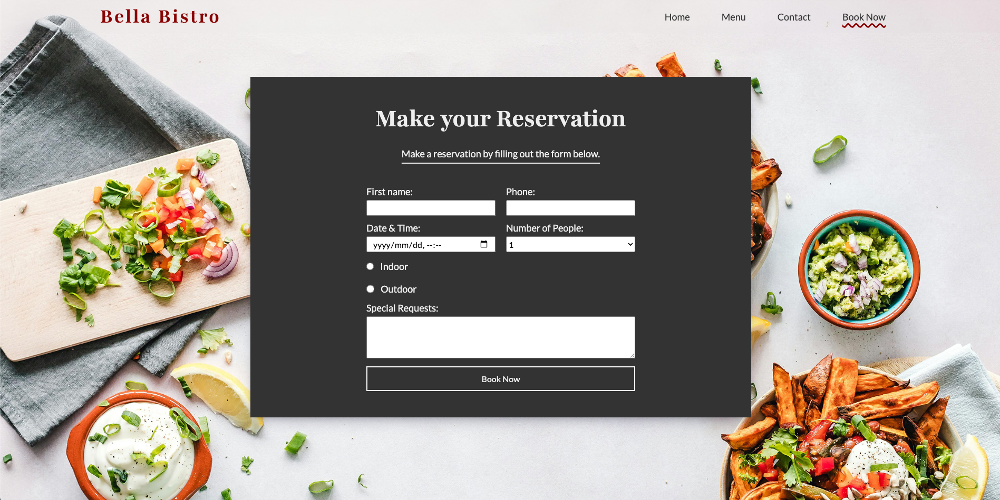

# Bella Bistro - HTML and SASS

Bella Bistro is a responsive, static mock website for a fictional restaurant. Built using HTML and SASS, this project demonstrates a clean and modern design approach across four pages: Home, Menu, Contact, and Reservations. It showcases essential web development skills and is ideal for portfolio demonstration or as a starting template for restaurant-themed sites.

## Table of Contents

- [Overview](#overview)
- [Installation](#installation)
- [Usage](#usage)
- [Screenshots](#screenshots)
- [Credits](#credits)

## Overview

Bella Bistro is a front-end project designed to simulate the online presence of a real-world restaurant. The site includes:

- **Home Page** — Introduction and key highlights of Bella Bistro
- **Menu Page** — Full menu categorized by meal type
- **Contact Page** — A contact form and address details
- **Reservations Page** — A form to book a table

Visit the live site here:  
👉 [Bella Bistro Live Demo](https://codebyxander.github.io/Bella-Bistro-HTML-SASS-Project/index.html)

## Installation

To run this project locally:

```bash
git clone https://github.com/codebyxander/Bella-Bistro-HTML-SASS-Project.git
cd Bella-Bistro-HTML-SASS-Project
```

You can now open the `index.html` file in your browser.

## Usage

This project is a static website and does not require a server or build step. Once you've cloned the repository, simply open the `index.html` file in any modern browser to view the site.

You can also explore or edit the SCSS files in the `scss` folder to customize the styles. Use a SASS compiler (like `sass` or a code editor extension) to compile the SCSS into CSS if making changes.

## Screenshots

Below are screenshots of the live Bella Bistro site in action:

### Home Page


### Menu Page


### Contact Page


### Reservations Page



## Credits

This project was designed and developed entirely by:

- [Xander](https://github.com/codebyxander)
